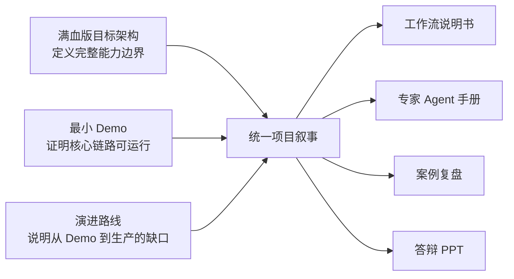

# 满血版目标架构与最小 Demo 双层范围基线

## 1. 文件目的

本文件固定项目后续说明书、专家手册、案例复盘和答辩 PPT 的共同口径。

项目采用“双层建设、三态表达”：

- **满血版目标架构**回答最终系统应该具备什么；
- **最小 Demo**回答本次实际证明了什么；
- **演进路线**回答尚未实现的能力如何补齐。

任何材料都不得只展示宏大架构而隐去实际完成度，也不得因为 Demo 范围较小而把项目描述成单一问卷生成器。

## 2. 三种状态

| 状态 | 含义 | 可以使用的答辩表述 | 禁止表述 |
|---|---|---|---|
| `VERIFIED` | 已存在真实文件、运行记录、数据或自动校验证据 | “已经完成”“已经验证”“本案例结果显示” | 无证据地扩大适用范围 |
| `DEMO` | 已在限定场景实现，仍有治理、样本或生产化限制 | “Demo 已跑通”“在本案例中验证” | “已全面上线”“可直接用于所有项目” |
| `TARGET` | 目标架构已经设计，但尚未全部运行或接入 | “目标架构支持”“后续可扩展为” | “系统目前已经具备” |

单个能力可以同时有不同层级。例如，问卷设计方法属于 `VERIFIED`，腾讯问卷发行属于案例 `DEMO`，多平台自动部署属于 `TARGET`。

## 3. 项目总定位

本项目建设一套以研究产物为契约、以专家能力为模块、由研究总控编排并保留人工责任的 AI 辅助用户研究工作流。

它解决的不是“让 AI 一次性写一份问卷”，而是把以下工作连接为可复用闭环：

> 研究需求 → 问题理解 → 研究方案 → 问卷/访谈 → 调研执行 → 数据处理 → 证据与洞察 → 报告与投资者教育建议 → 研究资产沉淀

基金用户研究是首个验证场景。核心工作流不绑定基金、IMA、腾讯问卷、Excel、某个模型或特定报告工具。

## 4. 三线关系

满血版提供结构完整性，Demo 提供可信证据，演进路线提供诚实边界。三者缺一不可。

## 5. 满血版目标架构

### 5.1 完整研究链路

1. 接收研究需求；
2. 将业务问题转化为待支持决策、研究目标、研究问题和可证伪假设；
3. 选择问卷、访谈或组合研究；
4. 设计研究工具、变量、题目、提纲、路由和分析计划；
5. 通过人工或外部渠道完成发行、招募、访谈和回收；
6. 将 Excel/CSV、逐字稿和反馈映射为规范化 FieldworkPackage；
7. 形成证据、发现、洞察、业务建议和投资者教育建议；
8. 面向不同受众生成忠实、可视化、可访问的研究报告；
9. 保存任务、模板、工具、分析方法、报告和候选画像，供后续研究复用。

### 5.2 专家与总控

| 组件 | 核心责任 | 正式输出 |
|---|---|---|
| CAP-01 研究问题理解 | 把模糊需求转成可研究问题 | ResearchBrief |
| CAP-02 研究方案设计 | 选择方法、证据和分析路径 | ResearchPlan |
| CAP-03 研究工具设计 | 设计问卷、访谈和数据契约 | InstrumentSpec |
| CAP-04 研究质量审核 | 检查结构、方法、事实、偏差和风险 | ReviewResult |
| CAP-05 证据与洞察 | 形成证据—发现—洞察—建议链 | InsightPackage |
| CAP-06 研究报告表达 | 忠实组织叙事、图表和投教板块 | ResearchReport |
| CTRL-01 研究总控 | 管理状态、版本、任务、路由和 Gate | WorkflowState / Task / Handoff |

专家负责语义判断，总控负责流程控制。CAP-04 和总控都不能生成正式人工批准。

### 5.3 产物与 Gate

核心链路：

> ResearchBrief → Gate 1 → ResearchPlan + InstrumentSpec + ReviewResult → Gate 2 → FieldworkPackage → InsightPackage → Gate 3 → ResearchReport → Gate 4

Gate 的作用不是增加形式，而是确保以下高风险变化由有权限的人确认：

- 研究问题是否值得研究；
- 问卷或访谈是否可以接触真实参与者；
- 洞察是否被证据支持；
- 报告是否可以正式发布。

### 5.4 工具与适配器

满血版通过适配器连接：

- 问卷平台；
- Excel/CSV 回传；
- 访谈、录音和转写工具；
- 报告和演示文稿渲染；
- 研究资产存储与检索；
- IMA 等知识入口。

外部工具不能改变核心 Artifact、专家职责或 Gate。平台失效时，主流程仍然成立。

### 5.5 用户理解与资产沉淀

满血版可以沉淀：

- 研究参与者画像；
- 项目内分群；
- 候选用户需求和行为模式；
- 问卷、访谈提纲、变量和分析模板；
- 研究结论及其证据索引；
- 投资者教育内容机会。

它不自动建设全量 CRM，也不把单次回答直接升级为正式客户标签、适当性标签或投资建议。

## 6. 最小 Demo 范围

### 6.1 Demo 主链

本次 Demo 聚焦：

> 研究需求 → ResearchBrief → ResearchPlan → 问卷 InstrumentSpec → 腾讯问卷发行 → CSV 回传 → 数据有效性处理 → InsightPackage → ResearchReport

访谈、完整招募、跨平台发行、组织级身份系统和自动资产推荐不作为本次 Demo 的必做项。

### 6.2 Demo 已证明的能力

| 能力 | 状态 | 证据 |
|---|---|---|
| 模糊需求转研究问题 | `VERIFIED` | 养老目标基金 ResearchBrief |
| 问卷研究方案与年龄分群 | `VERIFIED` | ResearchPlan 0.2.0 |
| 35 项问卷与数据契约一体化 | `VERIFIED` | InstrumentSpec 0.2.0、Word、腾讯问卷 |
| 金融事实审核 | `DEMO` | FOF 事实库及审核记录 |
| 智能发行与文件回传 | `DEMO` | 腾讯问卷及 200 份 CSV |
| 数据有效性与局限处理 | `VERIFIED` | FieldworkPackage、质量状态和敏感性分析 |
| 证据—发现—洞察—建议 | `VERIFIED` | InsightPackage |
| 分析先行的展示报告 | `VERIFIED` | ResearchReport 与最终 DOCX/PDF |
| 投资者教育建议 | `VERIFIED` | InsightPackage / ResearchReport 独立板块 |
| 本地总控运行时 | `DEMO` | Registry、状态修订、6 项运行时测试 |
| 专家判断边界 | `DEMO` | RUN-SMOKE-001 七条独立 Agent 冒烟测试 |
| 完整 Gate 1—4 新项目运行 | `TARGET` | 历史案例只有真实 Gate 1，未补造后续批准 |

### 6.3 Demo 不承担

- 不证明样本对全部养老目标基金投资者具有统计代表性；
- 不证明七项专家能力已经通过全部 39 条测试；
- 不证明工作流已经接入生产级组织权限、并发和备份；
- 不证明 IMA OpenAPI 可以跨环境读取知识库正文；
- 不自动招募、联系或识别参与者；
- 不自动把研究分群写入客户系统；
- 不自动决定产品、营销、投教或投资方案。

## 7. 满血版与 Demo 对照

| 维度 | 满血版目标 | 本次 Demo |
|---|---|---|
| 方法 | 问卷、访谈、定性、定量、组合研究 | 单一问卷主链 |
| 场景 | 新产品、客户认知、投资行为、服务体验、投教专题 | 养老目标基金购买者认知与持有 |
| 数据 | 问卷、逐字稿、反馈及授权业务资料 | 腾讯问卷 CSV |
| 分群 | 按研究问题选择必要分群 | 年龄为唯一基础分群 |
| 执行 | 多渠道适配器与人工执行 | 腾讯问卷智能发行 |
| 分析 | 定性、定量和混合证据整合 | 基础统计、年龄描述性比较、开放题主题 |
| 治理 | 完整 Gate、组织身份、持久化和审计 | 本地运行时；真实历史 Gate 2—4 缺失可见 |
| 资产 | 跨项目模板、证据与候选画像复用 | 项目文件、模板和案例索引 |
| 知识工具 | 受控知识检索、来源追溯和可选学习资源 | FOF 事实库；IMA 人工链接与保留接口 |

## 8. 答辩中的核心主张

### 可以明确主张

1. 已经设计一套平台无关、产物驱动的多 Agent 用户研究工作流。
2. 已用真实养老目标基金课题贯通问卷设计、200 份数据分析和报告生成。
3. 已将问卷设计与数据口径放在同一个 InstrumentSpec 中。
4. 已实现证据、发现、洞察、建议和报告的可追溯链。
5. 已实现本地总控运行时，并验证非法跳 Gate、AI 审批和版本失效等控制边界。
6. 已完成七项能力的首轮独立 Agent 冒烟测试，核心判断方向 7/7 一致，未观察到禁止行为。

### 必须带边界主张

1. 200 份样本只能支持本项目中的方向性判断，不能外推总体比例。
2. 历史案例没有完整 Gate 2—4，当前报告是内部展示材料。
3. 7 条冒烟不能替代全部 39 条模型评估，也没有完成人工语义验收。
4. 多平台、访谈执行、生产权限和资产推荐属于目标架构或后续工程化能力。

### 禁止主张

- “系统已经完全自动完成用户研究”；
- “AI 可以独立通过合规或发布审批”；
- “已经建立全量客户画像或 CRM”；
- “IMA 已经成为自动知识审核引擎”；
- “本次问卷结果代表全部投资者”；
- “39 条专家测试已经全部通过”。

## 9. 最小收尾范围

Demo 只再完成：

1. 三条定向回归：金融事实来源、CAP-05 下一路由、CAP-06 下一路由；
2. 完整工作流设计说明书；
3. 专家 Agent 提示词与能力手册；
4. 养老目标基金案例复盘；
5. 答辩 PPT。

不再增加专家数量，不把剩余 32 条能力测试设为答辩前置条件，也不建设新的平台前端。

## 10. 满血版后续路线

答辩后按价值和风险逐步推进：

1. 用全新项目在实际发行前形成真实 Gate 2，并继续形成 Gate 3、Gate 4；
2. 完成全部 39 条独立 Agent 测试及人工抽查；
3. 将本地运行时接入组织身份、持久化、备份和并发控制；
4. 增加访谈和混合研究的真实案例；
5. 增加受控资产检索、模板推荐和跨项目候选画像验证；
6. 在 IMA 接口满足跨环境读取、来源追溯和安全条件后再决定是否启用。
