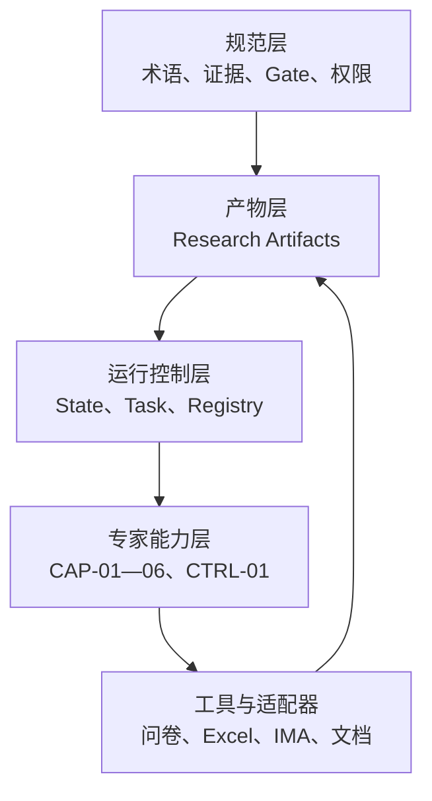

# AI辅助用户研究工作流设计说明书

## 摘要

本项目设计并验证了一套面向用户研究工作的多Agent协作工作流。它以研究产物为协作契约，以六类研究专家能力为语义处理单元，以研究总控管理状态、版本、权限和人工审核，把原本分散在需求沟通、问卷设计、访谈设计、数据处理和报告撰写中的工作连接成可追溯闭环。

系统的核心价值不是让AI代替研究人员，而是让AI承担结构化理解、初稿生成、规则检查、证据整理和报告表达，使研究人员把精力集中在问题判断、方法选择、风险审核和业务决策上。

满血版覆盖问卷、访谈、定性、定量和组合研究；本次Demo使用养老目标基金购买者研究，真实贯通了研究问题、问卷、腾讯问卷发行、200份CSV答卷、数据有效性处理、洞察和展示报告。

## 1. 项目背景与问题

### 1.1 传统研究流程的主要断点

在实际工作中，客户研究通常不是从清晰的研究问题开始，而是从模糊业务现象开始，例如：

- “客户为什么不理解这个产品？”
- “帮我做一个问卷看看。”
- “我们想知道用户喜不喜欢新基金。”
- “报告里能不能增加一些投资者教育建议？”

这些需求进入执行后容易出现五类断点：

1. **需求与研究问题脱节**：业务目标、研究目标、问卷题目和最终报告没有稳定映射。
2. **问卷与分析脱节**：问卷只设计题目，没有同时定义变量、缺失值、分群和有效性规则。
3. **分析与证据脱节**：报告中出现结论，但无法回到具体题目、分子分母、访谈片段或执行条件。
4. **平台与方法混在一起**：问卷平台、知识库或文档工具的限制反过来决定研究逻辑。
5. **AI责任边界不清**：生成、审核、批准和业务决策被混在同一个对话中，难以追溯和复核。

### 1.2 本项目要解决的问题

本项目希望建立一种可迁移的AI工作方式：

> 无论课题是新基金认知、投资行为、客户服务体验还是投资者教育专题，系统都能把需求转换为标准研究产物，调用适合的专家能力，经过必要审核后进入下一阶段，并最终沉淀为可复用研究资产。

## 2. 设计目标

### 2.1 业务目标

- 降低从业务需求到可执行研究方案的转换成本；
- 提高问卷、访谈、分析和报告之间的一致性；
- 让数据回传后可以直接按照预先定义的口径分析；
- 在报告中同时回答课题问题和投资者教育启示；
- 将项目成果保存为后续研究可复用的资产。

### 2.2 系统目标

- Agent之间通过结构化产物协作，而不是依赖完整聊天历史；
- 每项研究判断都有明确责任专家；
- 每个高风险节点保留人工决定权；
- 版本变化可以被发现并传播到下游；
- 外部平台可以替换，不改变核心工作流；
- 真实证据、示例数据、规划能力和人工批准严格区分。

### 2.3 非目标

系统不负责：

- 建设全量客户CRM；
- 自动招募或联系参与者；
- 自动生成正式客户标签或适当性标签；
- 自动决定基金产品、营销方案或投资建议；
- 用小样本研究估计市场总体；
- 代替合规、法务、隐私或业务负责人审批。

## 3. 总体架构

项目采用四层架构。

| 层级 | 主要内容 | 解决的问题 |
|---|---|---|
| 规范层 | 术语、证据、版本、数据有效性、金融事实、Gate和权限 | 大家用同一种口径判断 |
| 产物层 | Brief、Plan、Instrument、Fieldwork、Insight、Report等 | Agent通过什么交接 |
| 运行控制层 | WorkflowState、TaskRecord、Handoff、Registry和审计 | 当前在哪里、谁能做什么 |
| 能力与工具层 | 六位专家、研究总控、问卷/Excel/IMA/报告适配器 | 如何完成具体工作 |



这四层相互约束：

- 规范层决定什么是合法、可信和可批准；
- 产物层保存研究语义；
- 运行层只管理流程，不自行产生研究结论；
- 工具层执行具体动作，但不能改变核心口径。

## 4. 为什么采用产物驱动

### 4.1 聊天驱动的问题

如果多个Agent只通过对话协作，会产生：

- 上下文越来越长；
- 同一个概念反复改名；
- 上游修改后下游不一定知道；
- 很难确认某份问卷依据的是哪个研究方案；
- 无法区分讨论意见和正式批准。

### 4.2 产物驱动的解决方式

每个阶段产生一个有ID、版本、状态和上游引用的Artifact：

| 产物 | 回答的核心问题 |
|---|---|
| ResearchBrief | 为什么研究、支持什么决策、研究谁、回答什么 |
| ResearchPlan | 用什么方法、需要什么证据、如何分析 |
| InstrumentSpec | 具体问什么、如何记录、输出什么变量 |
| ReviewResult | 当前产物有什么问题、严重程度和退回位置 |
| ApprovalRecord | 哪个有权限的人批准了哪些精确版本 |
| FieldworkPackage | 实际执行了什么、收到什么数据、质量如何 |
| InsightPackage | 证据显示什么、如何解释、建议什么 |
| ResearchReport | 如何向目标读者忠实呈现研究结果 |

Artifact不是普通附件。它是Agent之间的机器契约：

- 输入必须引用精确版本；
- 输出必须引用上游；
- 已批准版本不能原地覆盖；
- 上游变更会使依赖旧版本的下游产物失效。

## 5. 专家能力体系

### 5.1 角色设计原则

专家数量不是越多越好。拆分标准是：

1. 是否承担独立的研究判断；
2. 是否拥有唯一核心产物；
3. 是否需要不同输入、权限和审核；
4. 是否存在必须分离的生成与复核责任。

由此形成六位研究专家和一个总控。

### 5.2 六位研究专家

#### CAP-01 研究问题理解专家

将Raw Demand转化为ResearchBrief，区分：

- 已知事实；
- 业务假设；
- 未知信息；
- 待支持决策；
- 研究目标；
- 研究问题；
- 可证伪假设。

它必须拒绝“帮我证明客户喜欢”一类预设结论，也不能直接越级写问卷题目。

#### CAP-02 研究方案设计专家

根据研究问题选择问卷、访谈或组合研究，建立：

> Research Question → Required Evidence → Method → Analysis

它必须说明为什么选择某种方法，也要说明哪些方法没有选择。便利小样本只能支持探索，不得包装为总体比例。

#### CAP-03 研究工具设计专家

把Plan中的一个方法实例转化为InstrumentSpec。

问卷模块负责：

- 测量目标与题型；
- 题目与选项；
- 变量和编码；
- 跳转与终止；
- 分群字段；
- 数据有效性规则；
- 金融事实引用；
- 完成后的可选学习资源。

访谈模块负责：

- 开放主问题；
- 中性追问；
- 具体事件和行为；
- 反例与替代做法；
- 主持说明和退出路径。

#### CAP-04 研究质量审核专家

CAP-04只产生ReviewResult，不直接改写上游产物，也不能生成ApprovalRecord。

审核范围包括：

- Schema和引用；
- 方法是否适配；
- 题目是否诱导、双重或不可达；
- 金融事实是否有来源；
- 数据和隐私边界；
- 证据是否支持主张；
- 报告是否忠实。

#### CAP-05 证据与洞察专家

把FieldworkPackage转化为：

> Source Record → Evidence Unit → Finding → Insight → Recommendation

它必须保留反例、分子分母、筛选和限制。金融研究还需要从同一证据链形成投资者教育建议，但偏好某种内容或形式不等于该方式有效。

#### CAP-06 研究报告表达专家

把已批准InsightPackage转化为ResearchReport。

它负责：

- 分析先行的叙事结构；
- 执行摘要和结论总览；
- 研究目的、方法和边界；
- 图表与文字；
- 投资者教育板块；
- 可访问性和最终渲染检查。

它不能重新分析数据，也不能删掉不利结果。

### 5.3 CTRL-01 研究总控

总控不负责研究语义，只负责：

- 当前阶段；
- 当前有效Artifact；
- 任务分派；
- 最小权限；
- 合法状态迁移；
- Gate等待和结果应用；
- 版本失效；
- 审计记录。

总控不能为了推进进度而改变专家结论，也不能把AI预审视为人工批准。

## 6. 完整运行流程

### 阶段1：接收需求

输入可以是新基金产品、客户认知、投资行为、服务体验或投资者教育专题。

总控创建项目和任务，但不把完整聊天记录当作正式研究输入。需要进入研究的问题被交给CAP-01。

### 阶段2：理解研究问题

CAP-01形成ResearchBrief，包括：

- 待支持决策；
- 研究背景；
- 研究目标；
- Research Questions；
- 假设与替代解释；
- 目标参与者画像；
- 最小数据需求；
- 研究范围和非范围；
- 分群与分析意图。

CAP-04进行质量预审，Gate 1由业务、研究或方法负责人确认研究问题是否值得继续。

### 阶段3：设计研究方案

CAP-02读取已批准Brief，设计ResearchPlan：

- 研究方法；
- 方法顺序；
- 样本和执行责任；
- 每个问题需要的证据；
- 分析方法；
- 缺失、排除和外推边界；
- 是否需要试答、试访或材料测试。

### 阶段4：设计问卷或访谈

总控按Plan的方法实例调用CAP-03：

- 一个问卷生成一个Survey InstrumentSpec；
- 一个访谈生成一个Interview InstrumentSpec；
- 组合研究可以并行生成多个InstrumentSpec。

CAP-04审核Plan、Instrument和金融事实。Gate 2必须批准拟执行的Plan、全部Instrument及其ReviewResult精确组合。

### 阶段5：执行调研

执行由人工、渠道或平台服务完成，不设置“招募Agent”自动联系客户。

问卷路径：

1. Adapter把InstrumentSpec转换为平台结构；
2. 人工确认后发行；
3. 平台回收并导出Excel/CSV；
4. Adapter完成字段映射、脱敏和规范化；
5. 依据InstrumentSpec执行答卷有效性规则；
6. 形成FieldworkPackage。

访谈路径：

1. 人工取得同意并主持；
2. 录音或笔记由授权工具处理；
3. 转写、匿名化并保留来源定位；
4. 形成FieldworkPackage。

### 阶段6：分析与洞察

CAP-05只读取已登记、脱敏且质量状态明确的资料。

分析过程包括：

- 核对执行版本和Gate 2；
- 重建RQ—数据源—分析映射；
- 执行定性、定量或组合分析；
- 保留反例与矛盾；
- 形成Finding、Insight和Recommendation；
- 明确局限与未回答问题；
- 增加由证据支持的投教建议。

CAP-04审核后，Gate 3由授权人确认洞察是否足以进入正式报告。

### 阶段7：报告生成

CAP-06根据受众生成ResearchReport。

管理层展示报告通常采用：

1. 封面；
2. 目录；
3. 核心结论总览；
4. 研究背景、目的和方法；
5. 按研究问题组织的分析正文；
6. 行动建议和投资者教育建议；
7. 限制和附录。

报告默认服务于没有看过问卷、也不熟悉专业术语的首次阅读者。每章在进入数据前说明研究问题、分析对象、题目或指标范围；重要数据段落先交代统计对象或筛选条件，再给数据、解释和业务意义。专业术语和“四道题全部答对”等综合指标第一次出现时，必须解释含义、组成和计算口径，不能依赖读者从附录或问卷中自行补齐。

CAP-04 在 Gate 4 前按 `STD-REPORT-READABILITY` 抽查总览、各章首段、术语和综合指标首次出现及分群图表。可理解性补充只能解释已批准 InsightPackage，不得成为 CAP-06 新增分析或洞察的通道。

Gate 4批准的是报告精确版本及分发范围，不等于业务建议已经被批准执行。

### 阶段8：研究资产沉淀

通过索引服务保存：

- 研究任务；
- 问卷和访谈提纲；
- 变量和分析模板；
- 证据索引；
- 洞察与报告；
- 候选画像；
- 适用范围和复用条件。

候选画像只能作为研究资产，不能自动写入CRM。

## 7. 问卷与数据一体化设计

本项目的重要优化是：数据处理不是问卷回收后的独立补丁，而是InstrumentSpec的一部分。

### 7.1 题目阶段同时定义

- 题目ID和变量名；
- 题型和选项值；
- 正常值和特殊值；
- “不知道、不适用、不愿回答”的含义；
- 结构性空缺；
- 知识题标准答案和事实来源；
- 分群用途；
- 后续报告对应关系；
- 硬排除和人工复核信号。

### 7.2 单份答卷状态

| 状态 | 含义 |
|---|---|
| UNASSESSED | 尚未执行质量规则 |
| VALID | 满足纳入要求 |
| REVIEW_REQUIRED | 有异常信号，需要复核 |
| EXCLUDED | 命中确定性排除规则 |

异常时长、逻辑冲突或疑似重复不能凭单个信号自动删除；知识题答错也不代表答卷无效。

### 7.3 整体数据集状态

| 状态 | 含义 |
|---|---|
| ANALYSIS_READY | 可以按计划分析 |
| ANALYSIS_READY_WITH_LIMITS | 可以分析，但必须披露偏差和限制 |
| BLOCKED | 关键版本、同意或质量问题尚未解决 |

数据状态和项目治理状态必须分开。例如养老目标基金数据是`ANALYSIS_READY_WITH_LIMITS`，但历史治理状态停在Gate 2待审。

## 8. 金融事实与IMA

### 8.1 金融事实审核

问卷中的以下内容不能只靠模型常识：

- 账户可投资范围；
- A/C/Y份额；
- 持有期；
- 费率；
- 产品名录；
- 下滑曲线具体数值；
- 风险和收益边界。

CAP-03必须使用适用事实库、监管文件或产品法律文件。来源缺失或冲突时：

```text
运行状态：ESCALATED
核心产物：NONE
下一路由：HUMAN-FINANCIAL-FACT
原因：列出需要确认的事实库、fact_id、版本和法律文件。
```

### 8.2 IMA的定位

IMA在当前架构中不是客户信息库，也不是必须依赖的事实审核引擎。

当前Demo只保留：

- 问卷完成后的可选学习链接；
- 由研究人员审核的知识库入口；
- 未来Adapter位置。

不记录点击、停留或身份关联，不把“展示链接”视为理解或投教效果。

## 9. Gate、版本和失效传播

### 9.1 四个Gate

| Gate | 批准对象 | 关键决定 |
|---|---|---|
| Gate 1 | ResearchBrief | 研究什么、为什么研究 |
| Gate 2 | Plan + Instrument + Review | 是否可以接触真实参与者 |
| Gate 3 | InsightPackage | 洞察是否被证据支持 |
| Gate 4 | ResearchReport | 报告是否可以按范围发布 |

### 9.2 AI与人工责任

- AI可以生成草稿和ReviewResult；
- AI不能生成代表人工决定的ApprovalRecord；
- 审批人必须针对精确版本组合批准；
- 领导着急、口头同意或聊天确认不能替代正式批准。

### 9.3 版本变化

如果InstrumentSpec 0.1.0已经批准，后来生成0.2.0：

1. 0.1.0保留，不被覆盖；
2. 0.2.0成为待审核新版本；
3. 依赖0.1.0的旧批准和下游任务标记为stale；
4. 工作流回到Instrument设计或Gate 2；
5. 新版本重新审核后才能继续。

这样可以避免“问卷改了，但分析仍沿用旧口径”。

## 10. 最小权限与数据保护

每个Agent只获得完成任务所需的信息。

| 组件 | 可以读取 | 默认禁止 |
|---|---|---|
| CAP-01 | 业务需求、授权背景 | 无关客户交易明细 |
| CAP-03 | 已批准Plan、事实库、材料 | 自动发行、读取全量客户信息 |
| CAP-05 | 脱敏FieldworkPackage | 姓名、联系方式、CRM写回 |
| CAP-06 | 已批准InsightPackage | 重新读取完整原始答卷 |
| CTRL-01 | Artifact引用和控制记录 | 改写研究语义或审批 |

原始个人标识不进入多Agent分析链；控制记录也不保存完整聊天历史或参与者资料。

## 11. 外部工具的协作方式

### 11.1 腾讯问卷

只承担智能发行、回收和文件导出。问卷的研究语义保留在InstrumentSpec中。

### 11.2 Excel/CSV

作为平台无关回传载体，通过字段映射、脱敏和质量处理进入FieldworkPackage。

### 11.3 Word、PDF和PPT

ResearchReport先保存语义内容，再由文档或演示工具渲染。排版不能在渲染阶段改变结论。

### 11.4 IMA

当前为人工可选学习入口和未来接口，不进入核心依赖。

## 12. 异常和退回机制

| 情况 | 处理 |
|---|---|
| 缺少研究决策或目标人群 | WAITING_INPUT，回需求方或CAP-01 |
| 研究方法无法支持总体外推 | CAP-02限制推断或要求改变抽样 |
| 金融事实缺失或冲突 | ESCALATED至人工事实审核 |
| 问卷诱导、双重或跳转错误 | CAP-04退回CAP-03 |
| 数据存在未解决BLOCKER | 停止CAP-05分析 |
| 反例与主结论冲突 | 保留反例、降低置信或提出竞争解释 |
| 报告需要新增分析 | CAP-06退回CAP-05 |
| 请求跳过Gate | 总控拒绝并记录非法迁移 |
| 外部平台不可用 | 使用平台无关文件或人工流程降级 |

每次Agent运行附加四行交接尾注，告诉总控当前状态、产物、下一路由和原因。

## 13. Demo运行情况

### 13.1 实际课题

“养老目标基金购买者的选择与持有认知调查——聚焦目标日期、目标风险与下滑曲线。”

### 13.2 实际贯通

- ResearchBrief和年龄基础分群；
- ResearchPlan；
- 35项问卷InstrumentSpec；
- Word和腾讯问卷；
- 200份CSV答卷；
- 字段映射、互斥冲突处理和敏感性分析；
- FieldworkPackage；
- 23个证据单元、5个Finding、3个Insight和3个Recommendation；
- 含独立投教建议板块的展示报告。

### 13.3 实际控制边界

- 数据可以在限制下分析；
- 历史项目只有真实Gate 1；
- Gate 2—4没有补造；
- 本地运行时因此把案例停在Gate 2待审；
- 执行、洞察和报告保留为真实历史产物，但不能推动当前治理流程。
- 领导审阅后的最终报告新增了年龄与投资经验分组分析；该内容尚未进入新的InsightPackage和ResearchReport，因此目前属于展示文件迭代，不应被描述为已经完成正式证据链登记。

## 14. 验证结果

当前已有：

- 16个Schema合成示例；
- 39条能力合同定义和无答案盲测包；
- 10项评分器抗错测试；
- 6项总控运行时测试；
- 7条独立Agent冒烟；
- 3条轻量交接回归；
- 200份真实答卷和正式追溯产物。

首轮冒烟中七项能力核心决策方向均正确，没有出现禁止行为。三项定向回归进一步验证了金融事实升级、洞察审核路由和报告安全退回。

这些结果证明Demo链路和关键边界可运行，但不能替代全部39条模型评估、人工语义验收和生产基础设施测试。

## 15. 迁移方式

将工作流迁移到新课题时，不复制养老目标基金的具体题目，而是复用以下结构：

1. 创建新project_id；
2. 使用CAP-01重新形成Brief；
3. 根据新问题由CAP-02选择方法；
4. CAP-03生成新Instrument；
5. 选择适用事实库和平台Adapter；
6. 按新Instrument映射回传数据；
7. CAP-05生成新的证据链；
8. CAP-06按新受众生成报告；
9. 全部Artifact使用新ID和版本。

因此，可迁移的是工作流、产物契约、专家能力和治理规则，而不是案例结论。

## 16. 满血版演进路线

### 近期

- 完成工作流说明书、专家手册、案例复盘和答辩PPT；
- 用一个全新课题在发行前形成真实Gate 2；
- 在报告前形成真实Gate 3和Gate 4。

### 中期

- 增加访谈和组合研究真实案例；
- 完成全部39条独立Agent测试和人工抽查；
- 接入组织身份、持久化、备份和并发控制；
- 增加资产检索和模板复用。

### 远期

- 在治理成熟后形成跨项目候选画像验证；
- 扩展更多金融事实领域；
- 根据接口条件决定是否启用IMA知识检索；
- 评估是否需要拆分定性/定量或问卷/访谈专家。

## 17. 最终结论

本项目的核心成果不是某一份问卷或某一份报告，而是一套可迁移的研究生产方式：

- 用ResearchBrief固定为什么研究；
- 用ResearchPlan固定如何研究；
- 用InstrumentSpec把问卷与数据口径连在一起；
- 用FieldworkPackage保存执行与质量；
- 用InsightPackage建立证据链；
- 用ResearchReport面向读者表达；
- 用Review、Gate、版本和总控保留人工责任。

Demo证明这条链路可以在真实课题中运行；满血版架构说明它如何扩展为完整的AI辅助用户研究系统。
