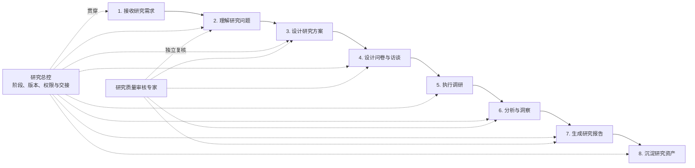

# AI 辅助用户研究工作流

一套以研究产物为交接契约、以专家能力为执行单元、以人工审核保留研究责任的多 Agent 用户研究工作流。

它不是单纯的问卷生成器，而是把**模糊业务需求、研究设计、问卷与访谈、数据质量、证据分析、报告表达和资产沉淀**连接成一条可复用、可追溯、可迁移的研究生产线。基金用户研究是首个真实应用场景，核心流程不绑定某个行业、模型、问卷平台或知识库。

> 当前状态：完整架构、专家能力、运行规则和真实案例均已形成；养老目标基金案例已完成 **35 项问卷、200 份答卷分析、分群比较、投资者教育建议和 19 页最终报告**。

## 快速入口

| 想了解什么 | 推荐入口 |
|---|---|
| 先看整体设计与运行效果 | [交互式 HTML 答辩稿](08_defense/05_presentation/AI辅助用户研究工作流_完整运行版.html) |
| 直接用于汇报 | [交互答辩版 PPTX](08_defense/05_presentation/AI辅助用户研究工作流_交互答辩版.pptx) |
| 准备答辩发言 | [Word 答辩稿](output/doc/AI辅助用户研究工作流_答辩稿.docx) |
| 修改答辩论述内容 | [Markdown 论述底稿](08_defense/05_presentation/AI辅助用户研究工作流_答辩论述底稿.md) |
| 理解完整工作流 | [完整工作流设计说明书](08_defense/02_workflow/full-workflow-design.md) |
| 查看专家为什么适合各环节 | [专家提示词手册](08_defense/03_experts/expert-agent-prompt-handbook.md) |
| 查看真实运行案例 | [养老目标基金案例复盘](08_defense/04_case/otf-case-retrospective.md) |
| 查看最终研究报告 | [最终版 Word 报告](output/doc/养老目标基金购买者认知、决策与持有行为调查报告_最终版.docx) |
| 查看全部权威文件 | [项目索引](INDEX.md) |

## 工作流总览



每个阶段都生成明确产物，下游专家读取经过确认的产物，而不是依赖冗长聊天记录。研究人员在关键节点确认研究范围、工具质量、洞察边界和最终发布。

## 核心设计

### 1. 产物驱动

工作流通过版本化研究产物交接：

`研究任务书 → 研究方案 → 问卷/访谈工具 → 执行数据包 → 洞察包 → 研究报告`

每项结论都能回到问题、变量、答卷或访谈证据；上游内容修订后，下游旧结果会被标记为失效，避免新旧版本混用。

### 2. 专家能力模组化

系统不要求一个通用 Agent 包办全部研究工作，而是把关键判断交给职责清晰的专家：

| 专家 | 核心职责 | 专业方法 |
|---|---|---|
| [研究问题理解专家](03_experts/cap-01-frame-research-question.md) | 把业务现象转成待支持决策、研究问题和可验证假设 | 决策导向框定、可证伪性、替代解释、数据最小化 |
| [研究方案设计专家](03_experts/cap-02-design-research-plan.md) | 选择问卷、访谈或组合方法，并预设证据和分析方式 | 方法适配、问题—证据对齐、预分析计划、外部效度 |
| [问卷与访谈设计专家](03_experts/cap-03-design-research-instrument.md) | 将抽象概念转成可回答、可分析的题目与提纲 | 构念操作化、构念效度、认知负荷、反应偏差 |
| [研究质量审核专家](03_experts/cap-04-review-research-quality.md) | 独立识别语义、方法、事实、隐私和表达风险 | 对抗性审核、严重度分级、测量污染、首次阅读测试 |
| [证据与洞察专家](03_experts/cap-05-synthesize-research-insights.md) | 从原始数据形成发现、洞察和行动建议 | 证据链、负例分析、三角互证、不确定性表达 |
| [研究报告表达专家](03_experts/cap-06-compose-research-report.md) | 将研究结论组织为领导和业务可理解的报告 | 受众导向叙事、主张—证据—含义—边界、可视化诚信 |
| [研究总控](03_experts/ctrl-01-orchestrate-research-workflow.md) | 管理阶段、版本、权限、退回与专家交接 | 有限状态编排、版本锁定、最小权限、失效传播 |

### 3. AI 辅助，人工负责

AI负责结构化理解、初稿生成、校验、统计整理和表达辅助；研究人员保留以下责任：

- 判断研究是否回答了真正的业务问题；
- 确认问卷、访谈材料和金融事实是否可用；
- 解释证据边界，避免把相关性写成因果；
- 决定建议是否进入业务决策或正式发布。

### 4. 平台可替换

问卷平台只承担发行、回收和导出。CSV 或 Excel 是正式回传载体，字段通过统一映射进入分析，不依赖平台自带画像或在线统计。知识库和报告工具也位于可替换的工具层，不改变研究主链。

## 八阶段如何运行

| 阶段 | 关键问题 | 主要产物 | 人工责任 |
|---|---|---|---|
| 1. 接收需求 | 业务究竟要做什么决定 | 原始需求记录 | 确认需求来源与时限 |
| 2. 理解问题 | 研究对象、问题和假设是什么 | 研究任务书 | 确认范围、对象与边界 |
| 3. 设计方案 | 用什么方法获得什么证据 | 研究方案、分析预案 | 确认方法与资源匹配 |
| 4. 设计工具 | 如何把概念转成可回答的问题 | 问卷或访谈提纲 | 审核诱导、跳转、事实与隐私 |
| 5. 执行调研 | 如何形成可分析的原始资料 | 答卷、逐字稿、执行记录 | 管理真实发行与参与者 |
| 6. 分析洞察 | 哪些发现有证据，边界在哪里 | 数据质量结果、洞察包 | 审核解释与反例 |
| 7. 生成报告 | 如何让首次阅读者看懂并行动 | 研究报告、投教建议 | 确认发布口径 |
| 8. 沉淀资产 | 哪些内容可在下一项目复用 | 模板、版本、方法与案例索引 | 管理权限与复用范围 |

## 真实案例：养老目标基金购买者研究

案例聚焦已经购买过养老目标基金的投资者，研究其产品类型认知、下滑曲线理解、购买决策、持有行为和信息需求。

已完成的真实运行包括：

- 将宽泛选题收紧为“购买者如何选择、理解和持有养老目标基金”；
- 生成并发行 35 项问卷，同时定义年龄分群、变量语义和数据有效性规则；
- 接收并映射 200 份平台导出答卷，排除 IP、设备和地理位置等非研究字段；
- 识别异常短时长和互斥选项冲突，并通过敏感性分析披露影响；
- 形成总体结果、年龄与投资经验探索性比较；
- 按“发现—证据—洞察—建议”生成研究报告；
- 单独提出投资者教育的重点内容、触达时点、表达形式和验证边界。

完整案例入口：

- [案例说明与正式产物清单](05_cases/养老目标基金购买者研究/README.md)
- [正式洞察包](05_cases/养老目标基金购买者研究/formal_artifacts/insight-package.v0.2.0.json)
- [聚合分群分析](05_cases/养老目标基金购买者研究/formal_artifacts/data/segment-analysis.v0.3.0.json)
- [最终版研究报告](output/doc/养老目标基金购买者认知、决策与持有行为调查报告_最终版.docx)

## 研究质量与治理

工作流把质量规则放在问卷设计阶段，而不是等数据回来后临时决定：

- 题目级：变量、取值、特殊值、结构性空缺和跳转逻辑；
- 答卷级：`VALID`、`REVIEW_REQUIRED`、`EXCLUDED`；
- 数据集级：`ANALYSIS_READY`、`ANALYSIS_READY_WITH_LIMITS`、`BLOCKED`；
- 洞察级：证据来源、分子分母、反例、限制和适用范围；
- 报告级：研究目的、样本画像、术语解释、结论总览和首次阅读测试。

金融研究另设事实复核规则。目前已建立 FOF 基础事实库，用于检查问卷和报告中的产品分类、份额、风险与下滑曲线等表达。

IMA 在本项目中只保留为**核心答题后的可选学习入口**：不存储客户信息、不追踪点击或停留、不进入研究证据链，接口位置保留但当前不启用。

## 仓库结构

```text
user-research-workflow/
├── 00_overview/       # 项目范围、边界与完整性复查
├── 01_standards/      # 术语、证据、审核、数据有效性、权限与事实规则
├── 02_schemas/        # 核心研究产物的机器可读结构与示例
├── 03_experts/        # 六位专家、研究总控、能力卡和方法参考
├── 04_workflows/      # 状态机与最小运行时
├── 05_cases/          # 真实案例及完整产物链
├── 06_adapters/       # 腾讯问卷发行与 Excel/CSV 回传适配
├── 07_evaluations/    # 合同场景、冒烟测试、评分器和运行时测试
├── 08_defense/        # 答辩说明书、专家手册、案例复盘和演示文件
├── output/            # Word、PDF、图表等正式展示交付物
├── outputs/           # 本地分析工作簿，不进入 GitHub 发布包
├── references/        # 外部仓库、Skill 与方法来源采用记录
├── INDEX.md           # 全量权威文件索引
└── CHANGELOG.md       # 版本与治理变更记录
```

`tmp/`、`__pycache__/` 等目录只保存构建或校验过程文件，不属于正式研究交付物。

## 如何阅读本仓库

- **领导或评审**：先看 [交互 HTML](08_defense/05_presentation/AI辅助用户研究工作流_完整运行版.html)，再进入案例报告。
- **用户研究人员**：先看 [完整工作流说明书](08_defense/02_workflow/full-workflow-design.md) 和 [专家能力总览](03_experts/expert-capability-overview.md)。
- **AI/工程实现人员**：重点查看 [Schema](02_schemas/README.md)、[状态机](04_workflows/workflow-state-machine.md) 和 [运行时](04_workflows/runtime/README.md)。
- **方法与合规审核人员**：重点查看 [审核关口](01_standards/review-gates.md)、[数据有效性](01_standards/data-validity-and-output-status.md) 和 [事实审核](01_standards/financial-facts/README.md)。

## 验证状态

- 39 条专家能力合同场景及盲测包已定义，并通过结构与交叉引用检查；这不等于 39 次独立 Agent 实测全部通过。
- 7 条独立 Agent 冒烟测试已运行，核心决策一致，精确机器契约仍暴露改进空间。
- 3 条专家交接回归达到轻量目标。
- 10 条评分器抗错测试和 6 条工作流运行时测试已通过。
- 27 页 HTML 与 PPTX 已完成链接、逐页渲染和来源备注检查。

更详细的版本、状态与验证记录见 [项目索引](INDEX.md) 和 [变更记录](CHANGELOG.md)。

## 数据与发布边界

- 原始答卷、逐条脱敏答卷、逐条质量状态和分析工作簿均留在本地，不进入 GitHub 发布包。
- GitHub 只保留聚合统计、研究产物、必要哈希、方法说明和最终展示文件。
- 研究分群不自动写入客户画像或适当性标签。
- AI 预审不等于人工批准，研究建议也不等于业务决策。
- 案例报告属于内部研究交付，不将 200 份非概率样本外推为市场总体。
